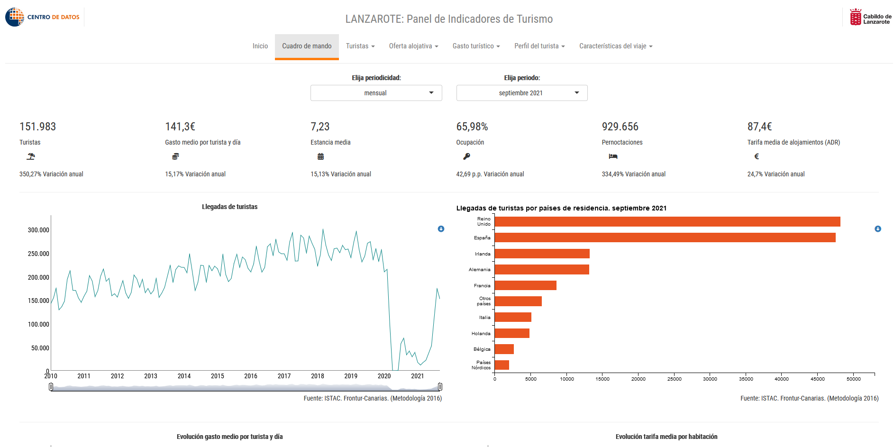

```{r setup, include=FALSE}
options(htmltools.dir.version = FALSE)
```


```{r xaringan-themer, include = FALSE}
# https://github.com/gadenbuie/xaringanthemer/blob/master/vignettes/css-help.Rmd
library(xaringanthemer)
mono_accent(
  base_color = "#43418A",
  header_font_google = google_font("Josefin Sans"),
  text_font_google   = google_font("Montserrat", "300", "300i"),
  code_font_google   = google_font("Droid Mono")
)
library(icon)
library(fontawesome)
library(emo)
library(xaringanExtra)
xaringanExtra::use_xaringan_extra(c("tile_view", "use_fit_screen"))
htmltools::tagList(
  xaringanExtra::use_clipboard(
    button_text = "<i class=\"fa fa-clipboard\"></i>",
    success_text = "<i class=\"fa fa-check\" style=\"color: #90BE6D\"></i>",
    error_text = "<i class=\"fa fa-times-circle\" style=\"color: #F94144\"></i>"
  ),
  rmarkdown::html_dependency_font_awesome()
)
```

background-image: url("images/JECAS-portada-presentacion-ponencias.png")
background-position: contain
background-size: 850px auto
---
class: inverse, center, middle

# Introducción

---

## Introducción

En la actualidad el incremento de fuentes de datos públicas proprociona amplias oportunidades a la investigación.

Este trabajo se enfoca en la reutilización de los datos que proporciona el Instituto Canario de Estadística (ISTAC) [`r fa("external-link-alt", fill = "#43418a")`](http://www.gobiernodecanarias.org/istac/)

Por un lado, busca facilitar la consulta y descarga de los datos disponibles en ISTAC. Asimismo, se emplea este desarrollo para la elaboracion de una apliacación web sobre indicadores de Turismo en Lanzarote, de utilidad al público en general y a los profesionales del sector en particular, que permite un estudio interactivo y amigable de la evolución del sector.

---

class: inverse, center, middle

# ISTAC

---

background-image: url("images/istac.png")
background-position: 50% 75%
background-size: 300px auto

## Usando la interfaz de ISTAC (1)

> El Instituto Canario de Estadítica (ISTAC) es el órgano central del sistema estadítico autonómico y centro oficial de investigación del Gobierno de Canarias, responsable, entre otras tareas, de proveer información y coordinar la actividad estadística pública en Canarias

---
background-image: url("images/consulta.png")
background-position: 85% 50%
background-size: 350px auto

## Usando la interfaz de ISTAC (2)

.pull-left[Los analistas del sector turístico acceden mediante la web a los datos del ISTAC para consultar la evolución del sector.


  - Sector servicios
  - Encuesta sobre gastos turísticos
  - Datos publicados
  - Series según metodología 2018
  - EGT / Series trimestrales del perfil del turista. Islas de Canarias. 2018-2021 (Metodología 2018)
  - Turistas de 16 y más años según características demográficas. Canarias por trimestres según años. Según grupos de edad y sexos por países de residencia]
  
---
background-image: url("images/nueva_consulta.png")
background-position: 50% 65%
background-size: 450px auto

## Usando la interfaz de ISTAC (3)


  
---
## APIs del ISTAC [`r fa("external-link-alt", fill = "#43418a")`](http://www.gobiernodecanarias.org/istac/datos-abiertos/documentacion-api/)

- **Tablas estadísticas (e-Base)** es el principal repositorio de datos que el ISTAC utiliza para el almacenamiento y difusión de los resultados estadísticos de la Comunidad Autónoma de Canarias.
- **Cubos estadísticos (e-Cubos)** es el banco de datos que almacena los recursos de información estadística y sustituirá gradualmente a e-Base.
- **Sistemas de indicadores estadísticos (e-Indicadores)** es el banco de datos que el Instituto Canario de Estadística (ISTAC) utiliza para el almacenamiento y difusión de los principales indicadores de Canarias, islas, municipios y otras granularidades territoriales.

---
background-image: url("images/TNZTD.png")
background-position: 50% 85%
background-size: 650px auto

## Motivación en el uso de Shiny

La inspiración de este proyecto, especialmente en lo que a visualización de datos se refiere, proviene de Nueva Zelanda.

En concreto, The New Zealand Tourism Dashboard [`r fa("external-link-alt", fill = "#43418a")`](http://tourismdashboard.mbie.govt.nz/).

Un proyecto espectacular `r emo::ji("open_mouth")`


---

## Herramientas

Dando respuesta a los dos apartados indicados:

* istacbaser [`r fa("external-link-alt", fill = "#43418a")`](https://github.com/rOpenSpain/istacbaser): Librería de R para acceder de manera programática a los datos disponibles mediante ISTACbase.


* Panel de Indicadores de Turismo de Lanzarote [`r fa("external-link-alt", fill = "#43418a")`](https://datosdelanzarote.shinyapps.io/turismo_dashboard/): Aplicación web desarrollada para el Cabildo de Lanzarote [`r fa("external-link-alt", fill = "#43418a")`](https://www.cabildodelanzarote.com/) a través de su Centro de Datos [`r fa("external-link-alt", fill = "#43418a")`](http://www.datosdelanzarote.com/) empleando Shiny [`r fa("external-link-alt", fill = "#43418a")`](https://shiny.rstudio.com/) que explota la información generada en la Estadística de Movimientos Turísticos en Fronteras de Canarias (FRONTUR-Canarias) [`r fa("external-link-alt", fill = "#43418a")`](http://www.gobiernodecanarias.org/istac/estadisticas/sectorservicios/hosteleriayturismo/demanda/E16028B.html), la Encuesta sobre Gasto Turístico [`r fa("external-link-alt", fill = "#43418a")`](http://www.gobiernodecanarias.org/istac/temas_estadisticos/sectorservicios/hosteleriayturismo/demanda/C00028A.html) y las Encuestas de Alojamientos Turístico [`r fa("external-link-alt", fill = "#43418a")`](http://www.gobiernodecanarias.org/istac/estadisticas/sectorservicios/hosteleriayturismo/oferta/C00065A.html)


---

class: inverse, center, middle

# LA LIBRERÍA ISTACBASER

---
background-image: url("images/ropenspain.png")
background-position: 85% 7%
background-size: 200px auto


## ISTACBASER

istacbaser es una librería de R para acceder de manera programática a todas las tablas de datos disponibles mediante la API ISTACbase. Actualmente es una contribución a la comunidad de software libre y datos abiertos rOpenSpain [`r fa("external-link-alt", fill = "#43418a")`](https://ropenspain.es/)..


## ¿Cómo usar istacbaser?

*Sencillo...* `r emo::ji("check")`

Aquí se indica una guía de uso [`r fa("external-link-alt", fill = "#43418a")`](https://github.com/rOpenSpain/istacbaser#getting-started). 

---

## Instalar istacbaser

Lo primero es descargar la librería desde Github y cargar los packages necesarios para este ejemplo, **dplyr** y **ggplot2**. 


```{r comment='#', message=FALSE}
# install and load istacbaser
# install.packages("remotes")
# library(remotes)
# remotes::install_github("rOpenSpain/istacr")
library(istacbaser)

# Load essentials package for this example
# install.packages("dplyr")
# install.packages("ggplot2")
library(dplyr)
library(ggplot2)
```


---

## Consultar datasets disponibles 


Un objeto clave en este package es `istacbaser::cache`. En este dataframe se recoge la información referida a cada una de las tablas disponibles. Puede verse mediante:

```{r comment="#"}
glimpse(cache)
```


---

## istacbase_search (búsqueda)

La función `istacbaser::istacbase_search` permite buscar tablas en base a un patrón determinado. La búsqueda se realiza por defecto en la variable `titulo`. Es posible el uso de expresiones regulares.

```{r}
busqueda_paro <- istacbase_search("paro")
```

* Regular expressions `paro|empleo`

```{r}
busqueda_paro_empleo <- istacbase_search("paro|empleo")
```

* Buscar en distintas variables de **cache** con el parámetro `fields`

```{r}
busqueda_paro <- istacbase_search("paro",
                                  fields = "datos publicadosI")
```

La salida de esta función es la fila o filas de `cache` que contengan la palabra con el patrón indicado dentro del campo solicitado. Otros campos se pueden obtener de `names(cache)`.

---

## Refinar la búsqueda

Queremos saber qué tabla es la que puede proporcionarnos el paro registrado según sexos y grupos de edad para las islas de Canarias.

```{r}
selectedID <- busqueda_paro %>%
    select(titulo,ID) %>%
    filter(grepl("sexo",titulo) &
           grepl("edad",titulo) &
           grepl("Islas",titulo)) %>%
    pull(ID)
```

```{r, echo=FALSE}
selectedID
```


---

## istacbase (descarga)


En una línea de código el dataset completo está listo para usarse:

```{r}
df <- istacbase(selectedID, POSIXct = T)
```

```{r}
head(df)
```
---

## ggplot (visualización)


```{r, eval=FALSE, echo=TRUE}
ggplot (df %>%
          filter(`Grupos de edad` == "TOTAL"
                  & Sexos != "AMBOS SEXOS"),
        aes(x = fecha, y = valor, colour = Sexos)) +
  geom_line() +
  facet_wrap(~Islas, scales="free_y") +
  theme_light() +
  theme(axis.text.x = element_text(angle = 45, hjust = 1)) +
  labs(x = "Years",
       y = "Registered unemployment",
       title = "Registered unemploy mentaccording to sex and islands",
       subtitle = "May 2005 - July 2021")
```

---

class: center

```{r, echo=FALSE, fig.width=10,fig.height=6}
ggplot (df %>%
          filter(`Grupos de edad` == "TOTAL"
                  & Sexos != "AMBOS SEXOS"),
        aes(x = fecha, y = valor, colour = Sexos)) +
  geom_line() +
  facet_wrap(~Islas, scales="free_y") +
  theme_light() +
  theme(axis.text.x = element_text(angle = 45, hjust = 1)) +
  labs(x = "Years",
       y = "Registered unemployment",
       title = "Registered unemploymentaccording to sex and islands",
       subtitle = "May 2005 - July 2021")
```

---

class: inverse, middle, center

# PANEL DE INDICADORES DE TURISMO DE LANZAROTE

---

Actualmente, el turismo genera 16099 millones de euros en Canariaá, el 35% del conjunto de su economía, y 343899 empleos, un 40.4% del total, según el último estudio de IMPACTUR^[Estudio IMPACTUR Canarias 2018] [`r fa("external-link-alt", fill = "#43418a")`](https://www.exceltur.org/impactur-2/#)


Dada la relevancia del turismo en la economía canaria, y más concretamente en la isla de Lanzarote, así como el acceso a la cantidad ingente de información que hay disponible a través del ISTAC [`r fa("external-link-alt", fill = "#43418a")`](http://www.gobiernodecanarias.org/istac/) resulta necesario fomentar el conocimiento y la difusión del mismo.

Con este fin se ha elaborado la aplicación Panel de Indicadores de Turismo de Lanzarote [`r fa("external-link-alt", fill = "#43418a")`](https://datosdelanzarote.shinyapps.io/turismo_dashboard/) que pretende ser un ejemplo de las posibilidades que ofrece la explotación de los datos en R.


---

## Convenio de colaboración

- Convenio de colaboración `r emo::ji("memo")`
    - Universidad de Las Palmas de Gran Canaria [`r fa("external-link-alt", fill = "#43418a")`](http://www.ulpgc.es)
    - Cabildo de Lanzarote [`r fa("external-link-alt", fill = "#43418a")`](https://www.cabildodelanzarote.com/), Centro de Datos [`r fa("external-link-alt", fill = "#43418a")`](http://www.datosdelanzarote.com/). 

- Herramientas `r emo::ji("package")`
    - istacbaser [`r fa("external-link-alt", fill = "#43418a")`](https://github.com/rOpenSpain/istacbaser)
    - Shiny [`r fa("external-link-alt", fill = "#43418a")`](https://shiny.rstudio.com/)
    - Dygraphs [`r fa("external-link-alt", fill = "#43418a")`](https://rstudio.github.io/dygraphs/)
    - billboarder [`r fa("external-link-alt", fill = "#43418a")`](https://github.com/dreamRs/billboarder)
    - leafleat [`r fa("external-link-alt", fill = "#43418a")`](https://rstudio.github.io/leaflet/)

- Fuentes de información (ISTAC) `r emo::ji("information")`
    - Estadística de Movimientos Turísticos en Fronteras de Canarias (FRONTUR-Canarias)[`r fa("external-link-alt", fill = "#43418a")`](http://www.gobiernodecanarias.org/istac/estadisticas/sectorservicios/hosteleriayturismo/demanda/E16028B.html)
    - Encuesta sobre Gasto Turístico[`r fa("external-link-alt", fill = "#43418a")`](http://www.gobiernodecanarias.org/istac/temas_estadisticos/sectorservicios/hosteleriayturismo/demanda/C00028A.html)
    - Encuestas de Alojamientos Turístico [`r fa("external-link-alt", fill = "#43418a")`](http://www.gobiernodecanarias.org/istac/estadisticas/sectorservicios/hosteleriayturismo/oferta/C00065A.html).
---


## Demanda Turística (FRONTUR, EGT)

- `r fa("plane-arrival", fill = "#43418a")` Llegadas de turistas 
- `r fa("euro-sign", fill = "#43418a")` Gastos 
- `r fa("umbrella-beach", fill = "#43418a")` Características del viaje
- `r fa("user", fill = "#43418a")` Perfil del turista.

---

### Llegadas de turistas 

La informacion sobre la serie de llegadas proporcionadas por FRONTUR puede ser configurable puediendo el usuario elegir entre visualización de datos de forma anual o mensual, los valores en nivel o como incrementos o como media móvil, entre otras opciones. 


---

### Gasto

La información de gasto analiza el gasto total, el gasto por turista y el gasto por turista y día. La evolución del gasto de los principales mercados de origen proviene de la Encuesta de Gasto Turístico. La evolución se puede analizar con frecuencia anual o trimestral. Existen varios filtros para analizar el mercado de origen, incluso con un desglose por concepto de gasto.


---

### Carecterísticas del viaje y Perfil del Turista

Las características del viaje valora aspectos para la elección del destino, el tipo de alojamiento, la duración de la estancia y las actividades realizadas por los turistas.

Con el perfil del turista se intenta analizar las características del turista en términos de género, edad, ocupación e ingresos.


---


## Oferta Turística (EAT)

- `r fa("bed", fill = "#43418a")` Ocupación
- `r fa("hotel", fill = "#43418a")` Establecimientos y plazas ofertadas 
- `r fa("coins", fill = "#43418a")` Tarifa media diaria (ADR)
- `r fa("layer-group", fill = "#43418a")` Mapa de oferta alojativa.


---


---

### Cuadro de mando




---

class: inverse, middle, center

# Conclusiones
---

# Conclusiones

- El sector público está tomando conciencia de la necesidad de que sus datos estén abiertos.

- Desarrollo de una librería de R que manejase la API ISTACbase.

- Desarrollo del 'Panel de Indicadores de Turismo de Lanzarote'.
    - Brinda a los profesionales del sector toda la información relacionada con el turismo de Lanzarote en un solo lugar para su consulta y análisis.
    
- **Limitaciones**
    - Cambios en la API

---
class: inverse, middle, center

# Desarrollo de dashboard para la monitorización de datos en destino turístico.
## El caso del Panel de Indicadores de Turismo de Lanzarote

Christian González-Martel `r fa("twitter", fill = "white")` `r fa("github", fill = "white")` @chrglez

José Manuel Cazorla-Artiles `r fa("twitter", fill = "white")`  `r fa("github", fill = "white")` @jmcartiles


## ¡Gracias!


